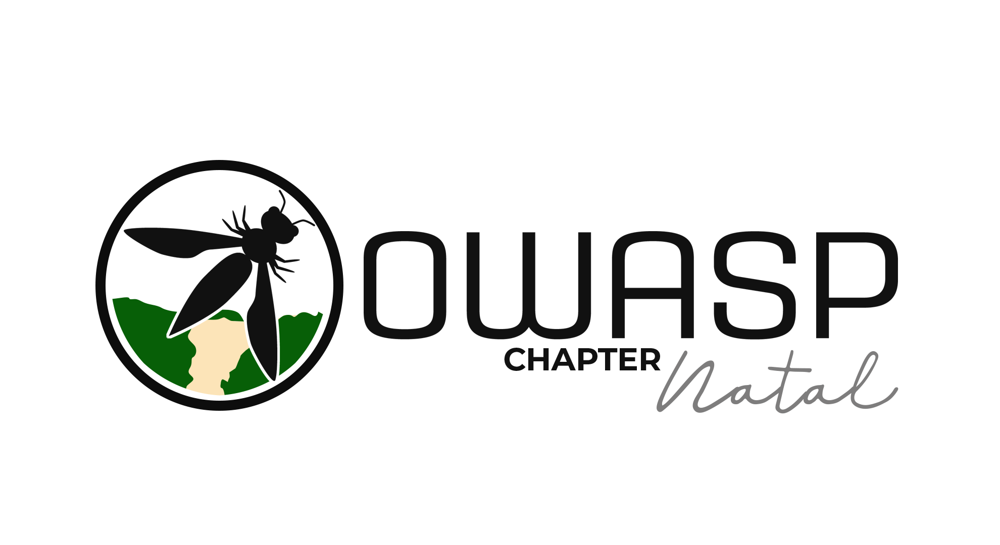

## OWASP Natal Chapter


## Bem vindos!
Somos o Capítulo Natal/RN do Owasp.

O Open Web Application Security Project (OWASP) é uma organização sem fins lucrativos que trabalha para melhorar a segurança do software. Todos os projetos, ferramentas, documentos, fóruns e capítulos são gratuitos e abertos a qualquer pessoa interessada em melhorar a segurança das aplicações. 

Natal é a capital do estado de Rio Grande do Norte, na extremidade do nordeste do Brasil. É conhecida pelas extensas dunas de areia costeiras e pelo Forte dos Reis Magos, em forma de estrela, uma fortaleza portuguesa do século XVI na foz do rio Potengi. A norte do rio, Genipabu é uma área de enormes dunas com uma lagoa de água doce. Natal possue uma área de aproximadamente 167 km², é a segunda capital brasileira com a menor área territorial e a sexta maior capital do país em densidade populacional, distando 2.227 quilômetros de Brasília, a capital federal.


## Participação

Todos são bem vindos e bem vindas a participar do nosso capítulo!
Para isso basta comparecer as nossas reuniões, que (normalmente) são mensais, sempre as segunda quinta-feira do mês. Mas avisado previamente e criado um evento no Meetup do nosso capítulo.

Todos são bem-vindos e incentivados a participar de nossos [Projects](/projects), [Local Chapters](/chapters), [Events](/events), [Online Groups](https://groups.google.com/a/owasp.com/){:target='_blank'}, and [Community Slack Channel](https://owasp.slack.com/){:target='_blank'}. Incentivamos especialmente a diversidade em todas as nossas iniciativas. O OWASP é um lugar fantástico para aprender sobre segurança de aplicativos, rede e até mesmo para construir sua reputação como especialista. Também o encorajamos a ser [tornar-se membro] (/membership) ou considerar uma [doação] (/donate) para apoiar nosso trabalho em andamento.

Os capítulos são liderados por líderes locais, de acordo com o [Manual do Líder do Capítulo] (/www-policy/rules-of-procedure/chapter-handbook). As contribuições financeiras só devem ser feitas on-line usando o botão de doação on-line autorizado. Para ser um ALTO-FALANTE em QUALQUER Capítulo da OWASP no mundo, basta revisar o [acordo do orador] (/www-policy/speaker-agreement) e, em seguida, entre em contato com o líder do capítulo local com detalhes do projeto OWASP, pesquisa independente ou tópico de segurança de software relacionado você gostaria de apresentar.
```
Chapters are led by local leaders in accordance with the [Chapter Leader Handbook](/www-policy/rules-of-procedure/chapter-handbook). Financial contributions should only be made online using the authorized online donation button. To be a SPEAKER at ANY OWASP Chapter in the world simply review the [speaker agreement](/www-policy/speaker-agreement) and then contact the local chapter leader with details of what OWASP Project, independent research, or related software security topic you would like to present.

Everyone is welcome and encouraged to participate in our [Projects](/projects), [Local Chapters](/chapters), [Events](/events), [Online Groups](https://groups.google.com/a/owasp.com/){:target='_blank'}, and [Community Slack Channel](https://owasp.slack.com/){:target='_blank'}. We especially encourage diversity in all our initiatives. OWASP is a fantastic place to learn about application security, to network, and even to build your reputation as an expert. We also encourage you to be [become a member](/membership) or consider a [donation](/donate) to support our ongoing work.

## Local News
- Meeting Location
- Everyone is welcome to join us at our chapter meetings.

```
{info.md}

This separate file is where you should place links to your Google Group and Meetup page. It will be automatically rendered in the column sidebar.

{leaders.md}

Another separate file that should simply include each leaders name with mailto link as a list. It will also be automatically rendered in the column sidebar.

-->
