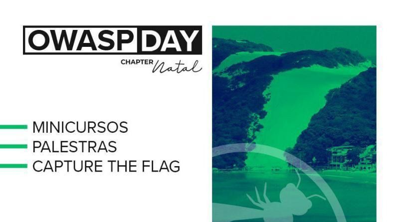

## OWASP DAY NATAL

### 2019

**Local**: IMD - Instituto Metropóle Digital · Natal

#### Palestras

- 8:30 Implantando um programa de segurança com quase nenhum centavo, Fernando Guisso
- 9:15 Extração avançada de dados em dispositivos móveis por meio de Chip Off, Jorge Ramos de Figueiredo
- 10:10 CTF (Capture The Flag) no Ensino de Segurança em Ambiente Controlado, Ricardo Kléber
- 10:45 LGPD para Segurança da Informação, Anna Luiza Raves
- 11:30 Falando sobre Reverse Tabnabbing, Gabrielle Maria Delgado
- 12:15 até 13:30 Almoço
- 13:30 Inicio do CTF
- 14:00 Engenharia Social na série MR Robot, Chris Henrique Silva
- 14:45 [Kit inteligencia com OSINT e Docker](assets/files/kit-de-inteligencia_OSINT_DOCKER.pdf), Julio Lira
- 15:30 Coffee Break
- 16:00 Segurança em nuvem: A ameaça fantasma, Matheus de Oliveira
- 16:45 Porque você deve usar o HTTPS, José Maria Jr.
- 17:30 Hackeando apps Jira com Shodan, Vitor Fernandes
- 18:30 Encerramento

#### Mini cursos

- Ter conhecimentos em programação.
- A linguagem abordada será PHP.
- Levar notebook com alguma IDE instalada.

