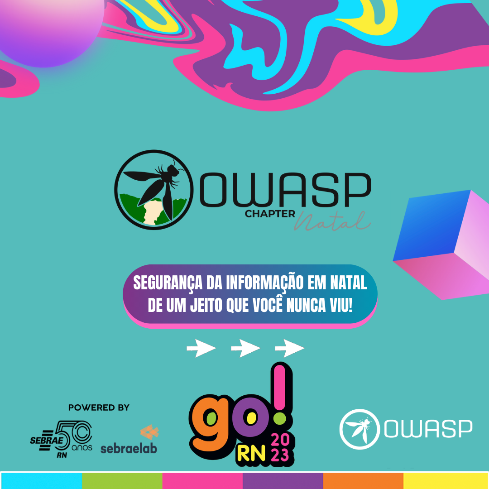

## GORN

### 2023

**Local**: Centro de Convenções · Natal

#### Palestras

03 de Novembro

- 10:30 Proteção e prevenção contra XSS no front-end, Allyne Ferreira
- 11:00 Introdução ao Firmware Hacking, Matheus Cezar
- 14:00 Security Misconfiguration: Pequenos problemas, grandes impactos, Anderson Cirilo
- 17:00 Blue Team: Detecções e Ameaças, Josué Santos
- 18:00 Conscientização em Segurança da Informação, Gustavo Marques & Josu

04 de Novembro

- 11:00 Vazando arquivos sensíveis por meio de URLs, Eduardo Paixão
