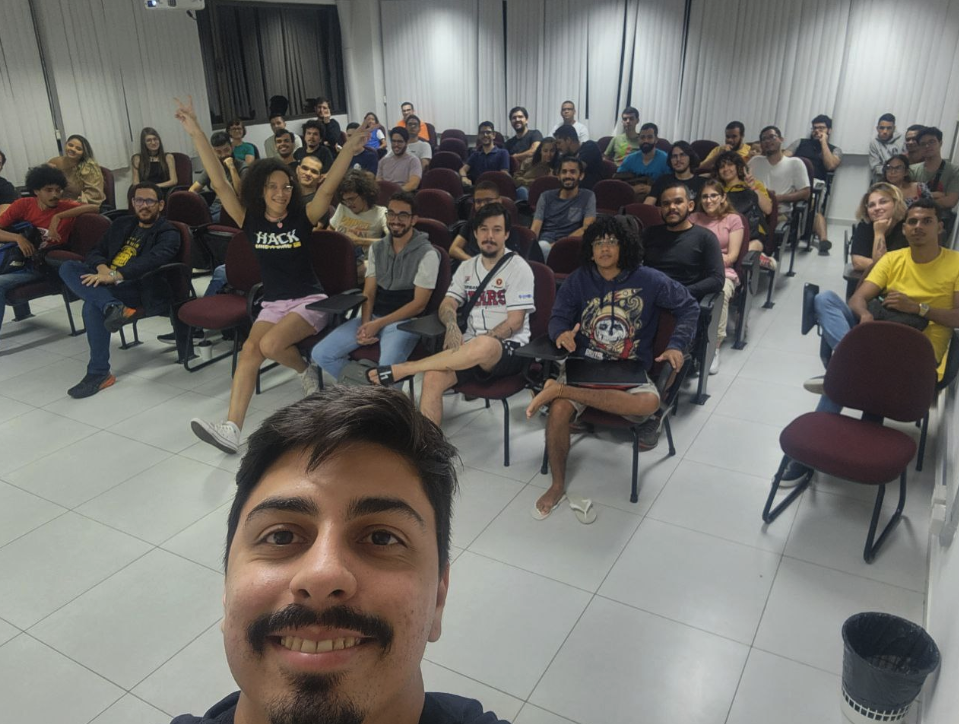
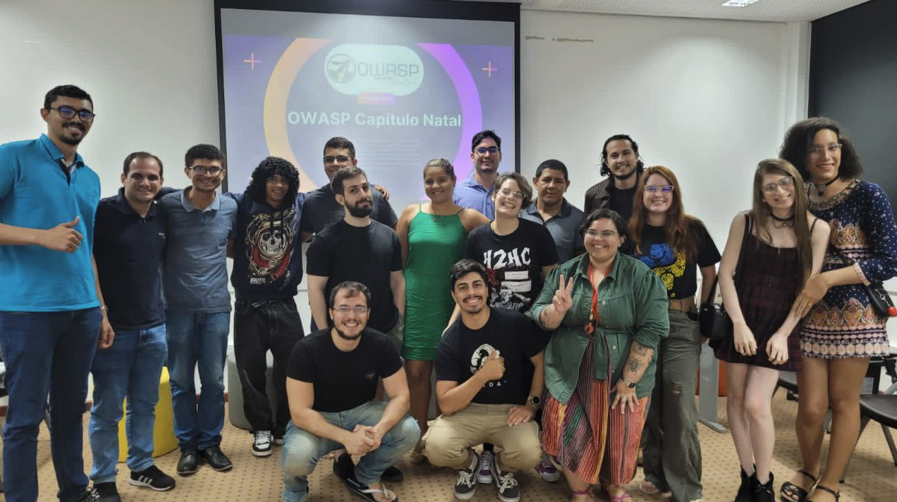

### Ultimos encontros

#### 2023

#### Meetup Presencial #02
**Data**: 23/05/2023
**Location**: IMD
- Mesa redonda sobre carreira na area de segurança da informação
- **Matheus Cezar** @ Analista de segurança na Conviso AppSec
- **Kali Nathalie** @ Analista de segurança na Conviso AppSec
- **Kadson Breno** @ Especialista em Segurança da Informação na Unicred do Brasil(UBR)
- **Caio Luders** @ Lead Red Team na WillBank
- **Alyson Nakamura** @ Sócio na Qualitek
- **Eduardo Paixão** @ Pentester na STI
- **Fernando Guisso** @ AppSec Engineer na Globo

#### Meetup Online #01
**Data**: 14/03/2023
**Location**: Online
- Como o capítulo OWASP Natal funciona?
- Dicussão sobre carreira na area de segurança da informação
Alguns participantes da dicussão:
- **Matheus Cezar** @ Analista de segurança na Conviso AppSec
- **Clara Nobre** @ Analista de segurança em cloud na ContaSimples
- **Eduardo Santos** @ Tech Manager AppSec and Red Team na BEES Bank Brasil
- **Fernando Guisso** @ AppSec Engineer na Globo

#### Meetup Presencial #01

**Data**: 01/02/2023
**Location**: Seahub Sebrae Natal
- Apresentação sobre OWASP - **Matheus Cezar**
- Como o capítulo OWASP Natal funciona?
- Como funciona a segurança de aplicações da TV Globo - **Fernando Guisso**

 <b>2022</b>

#### 2° Virtual Meeting
**Data**: 12/12/2022
**Location**: Web
- Documentação individual - **Ulises Alves**
[Gravado](https://youtu.be/wqSCCWy5OOg)

#### 1° Virtual Meeting
**Data**: 24/03/2022
**Location**: Web
- [Side Effect](https://www.notion.so/signed/https%3A%2F%2Fs3-us-west-2.amazonaws.com%2Fsecure.notion-static.com%2F28b82aed-bc68-49f2-9219-18449321c8f0%2FMeetup_Natal_-_Slides.pdf?table=block&id=e8472a4d-c1ee-40f9-b88c-952dcdaac501) - **Diego Albuquerque**
[Gravado](https://www.youtube.com/watch?v=EGW_2nLG2Og)

 <b>2021</b>

#### 5° Virtual Meeting
**Data**: 21/12/2021
**Location**: Web
- Do desenvolvimento á Segurança - **Helena Carreço**

#### 4° Virtual Meeting
**Data**: 08/12/2021
**Location**: Web
- Do suporte técnico á Segurança - **Clara Nobre**

#### 3° Virtual Meeting
**Data**: 06/07/2021
**Location**: Web
- Entregando real valor atraves de relatorios pentest - **Ulises Alves**

#### 2° Virtual Meeting
**Data**: 09/03/2021
**Location**: Web
- OWASP Code Review Guide - **Matheus Cezar**

#### 1° Virtual Meeting
**Data**: 02/02/2021
**Location**: Web
- [Kubernetes Security 101](https://www.devseccon.com/kubernetes-security-101-best-practices-to-secure-your-cluster-secadvent-day-17/) - **Magno Logan**
[Gravado](https://www.youtube.com/watch?v=CF-ScdbhU5o)

 <b>2020</b>

#### 2° Virtual Meeting
**Location**: Web
 - [DevSecOps na prática com ferramentas open source](assets/files/DevSecOpsNaPratica.pdf)

#### 1° Virtual Meeting
**Location**: Google Meet

#### Talk
 - [AppSec muito além do SAST]()

#### Reunião 0

**Location**: Jerimum Hacker Space | Rua São Pedro 19E(Saint Peter
Street number 19E)

##### TOPICS HOGHLIGHTS

  - OSINT
  - Docker
  - Tools
  - - Grupo Telegram: [@OSINT_BR](https://t.me/osint_br)
  - - Canal Telegram: [@OSINT_CHANNEL](https://t.me/osint_channel)
  - - [OWASP D4N155](https://github.com/OWASP/D4N155/)
  - - [Google Dorks EXPLOIT-DB](https://www.exploit-db.com/google-hacking-database)
  - - [GETRAILS](https://github.com/Vault-Cyber-Security/getrails)
  - - [Container de OSINT](https://github.com/Vault-Cyber-Security/osint)
  - - [VEGA](https://subgraph.com/vega/)
  - - [pwndb](http://pwndb2am4tzkvold.onion/)
  - - [Dirb](https://tools.kali.org/web-applications/dirb)
  - - [Sherlock](https://github.com/sherlock-project/sherlock)

 <b>2019</b>

#### Reunião 0

**Location**: Jerimum Hacker Space | Rua São Pedro 19E(Saint Peter
Street number 19E)

##### TOPICS HOGHLIGHTS

  - Chapter presentation
  - Owasp Overview
  - Chapter's Leaders Presentation

#### Reunião 1

**Location**: Jerimum Hacker Space | Rua São Pedro 19E(Saint Peter
Street number 19E)

##### TOPICS HOGHLIGHTS

  - Presentation of OWASP's projects such as:
  - OWASP TOP10
  - Among others

#### Reunião 2

**Location**: Jerimum Hacker Space | Rua São Pedro 19E(Saint Peter
Street number 19E)

##### TOPICS HOGHLIGHTS

  - Use github.com/globocom/secdevlabs/ labs to test the TOP10 and
    research exploit tools

#### Reunião 3

**Location**: Jerimum Hacker Space | Rua São Pedro 19E(Saint Peter
Street number 19E)

##### TOPICS HOGHLIGHTS

  - Using github.com/owasp/juicyshop/ labs to test the TOP10 and
    research exploit tools

**Everyone is welcome to join us at our chapter meetings.participation
in events**

## Participation in events

[Devfest nordeste](http://ne.devfest.com.br/)

[Category:OWASP Chapter](Category:OWASP_Chapter "wikilink")

